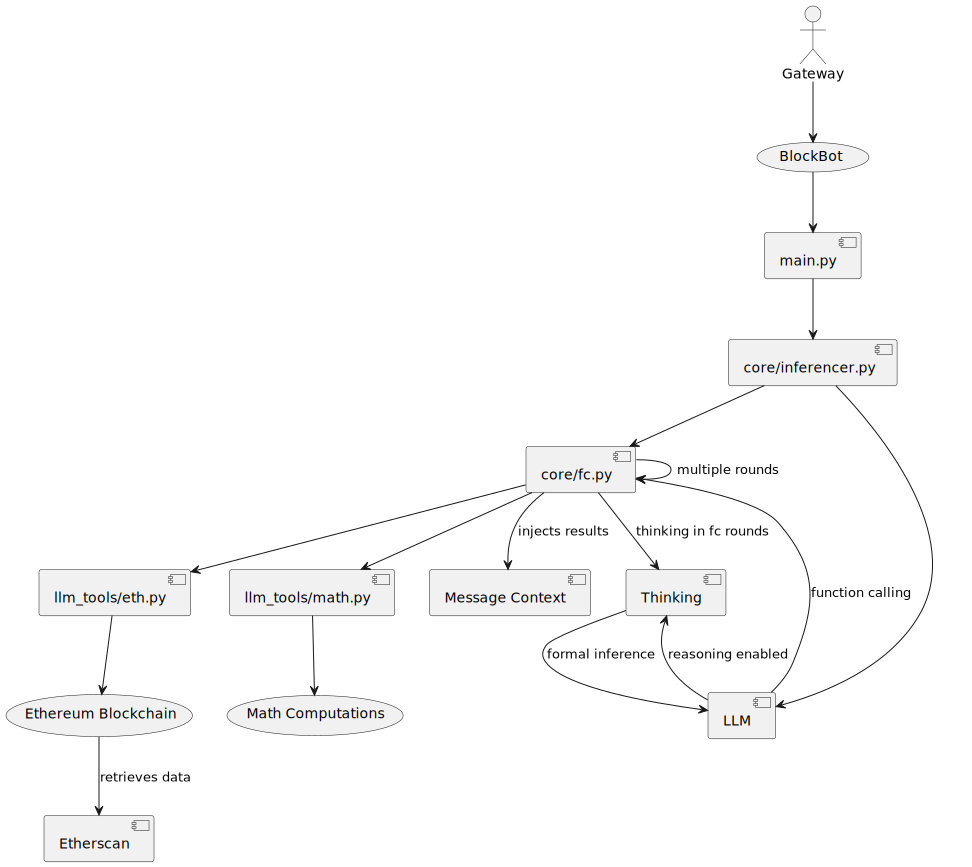

<div align="center">

# BlockBot

_A Blockchain Chatbot with Reasoning and Function Calling_

</div>

## 1. Introduction

BlockBot (https://github.com/itdevwu/blockbot) is an innovative blockchain chatbot leveraging the Qwen 3 Large Language Model (LLM) to provide natural language interactions with blockchain and mathematical functionalities through advanced reasoning and function calling. This report explores the evolution of natural language processing (NLP) and LLMs, the landscape of web3 AI chatbots, and the architectural and implementation details of BlockBot. It highlights why Qwen 3 was chosen, the significance of native reasoning and function calling, and how BlockBot contributes to the web3 ecosystem.

## 2. History of Natural Language Processing

NLP has evolved significantly since the 1950s, transitioning from rule-based to statistical and, most recently, neural network-based approaches. Key milestones include:

- **Raw NLP (1950s–1980s)**: Rule-based systems like ELIZA used pattern matching for basic dialogue [1].
- **Statistical NLP (1990s–2000s)**: Techniques like Hidden Markov Models and n-grams enabled probabilistic language modeling [2].
- **Neural NLP (2010s–present)**: Recurrent Neural Networks (RNNs) and Long Short-Term Memory (LSTM) networks improved sequence modeling, followed by the transformative impact of Transformers in 2017 [3].

Transformers, introduced by Vaswani et al., revolutionized NLP with their self-attention mechanism, enabling parallel processing and capturing long-range dependencies [3]. This laid the foundation for modern LLMs, including GPT, Gemini, Qwen, and DeepSeek, which power advanced chatbots like BlockBot.

## 3. Revolution of Large Language Models

### 3.1 Model Architectures

LLMs have advanced through innovations in model architectures:

- **Multi-Head Attention (MHA)**: Introduced in the Transformer, MHA allows models to focus on different parts of the input simultaneously, improving context understanding [3].
- **Multi-Query Attention (MQA)**: Reduces memory usage by sharing key and value projections across heads, improving efficiency [4].
- **Grouped-Query Attention (GQA)**: Balances MHA and MQA by grouping queries, optimizing performance for large-scale models [5].
- **Multi-head Latent Attention (MLA)**: First introduced in DeepSeek-V2 and inherited by DeepSeek-V3 and DeepSeek-R1, MLA compresses the Key-Value cache into a latent vector, significantly reducing memory usage and enabling efficient inference for large-scale models [6].

These architectures enable LLMs to process complex inputs efficiently, critical for BlockBot’s blockchain and math tasks.

### 3.2 Training Algorithms

Training LLMs involves sophisticated algorithms to optimize performance:

- **Proximal Policy Optimization (PPO)**: A reinforcement learning (RL) algorithm used for fine-tuning LLMs, balancing exploration and exploitation [7].
- **Direct Preference Optimization (DPO)**: Simplifies RL by directly optimizing human preferences, improving alignment [8].
- **Simplified Preference Optimization (SimPO)**: Enhances DPO with fewer hyperparameters, increasing efficiency [9].
- **Group Relative Policy Optimization (GRPO)**: A training algorithm that enhances policy optimization by leveraging group relative preferences, improving the model's ability to handle diverse reward structures [10].
- **Decoupled Clip and Dynamic sAmpling Policy Optimization (DAPO)**: An algorithm that decouples clipping and dynamically samples policies to improve optimization stability and efficiency [11].

These algorithms enhance LLMs’ reasoning and alignment, enabling BlockBot’s natural language capabilities.

### 3.3 Model Outputs

LLMs excel in two key outputs relevant to BlockBot:

- **Reasoning**: Techniques like Chain-of-Thought (CoT) prompting improve logical and mathematical reasoning by generating intermediate steps [12]. Tree-of-Thought (ToT) extends this by exploring multiple reasoning paths [13].
- **Function Calling**: LLMs can invoke external functions based on user input, enabling interactions with APIs or tools like blockchain nodes [14].

These capabilities allow BlockBot to process complex queries and execute blockchain transactions seamlessly.

### 3.4 Typical Models

Several LLMs are notable in the current landscape:

| **Model**       | **Developer**     | **Key Features**                                                                 | **Benchmarks**                     |
|-----------------|-------------------|----------------------------------------------------------------------------------|------------------------------------|
| DeepSeek V3     | DeepSeek AI       | Mixture-of-Experts, long-context understanding, strong coding/math performance    | MMLU: 89%, GSM8K: 95% [15]        |
| DeepSeek R1     | DeepSeek AI       | Optimized for reasoning, efficient inference                                      | AIME: 70%, MATH-500: 85% [16]     |
| Qwen 2.5        | Alibaba Group     | Improved architecture, hybrid reasoning modes, strong multilingual support       | MMLU: 87%, GSM8K: 93% [17]        |
| Qwen 3          | Alibaba Group     | Advanced reasoning, function calling, optimized for tool use                     | MMLU: 90%, GSM8K: 96% [18]        |

**Why Qwen 3?** Qwen 3 was chosen for BlockBot due to its superior performance in reasoning and function calling, as demonstrated in benchmarks like MMLU and GSM8K [18]. Its hybrid reasoning modes (step-by-step for complex tasks, direct for simple queries) and robust tool-use capabilities align with BlockBot’s need for blockchain and math interactions. Additionally, Qwen 3’s open-source availability and active community support facilitated integration [18].

## 4. Web3 AI Chatbots and Blockchain LLMs

### 4.1 Current Status

Web3 AI chatbots integrate LLMs with blockchain to enhance security, accessibility, and decentralization. Key applications include:

- **Smart Contract Auditing**: LLMs like TrustLLMf detect vulnerabilities in smart contracts, improving security [19].
- **Transaction Anomaly Detection**: Tools like BlockGPT monitor blockchain transactions for fraud, achieving high accuracy [20].
- **Natural Language Interfaces**: Chatbots like ChainGPT simplify blockchain interactions, making them accessible to non-technical users [21].
- **Decentralized AI**: Frameworks like ChainGPT’s AIVM Blockchain enable on-chain LLM training and inference [21].

### 4.2 Why BlockBot’s Approach Works

BlockBot’s native reasoning and function calling capabilities set it apart:

- **Native Reasoning**: By leveraging Qwen 3’s CoT and ToT, BlockBot breaks down complex blockchain and math queries into manageable steps, ensuring accurate responses [12], [13].
- **Function Calling**: Custom functions in `llm_tools/eth.py` and `llm_tools/math.py` allow BlockBot to interact with Ethereum and perform calculations, extending beyond text generation [14].

This combination enables BlockBot to handle real-world tasks like querying blockchain data or solving equations, addressing the accessibility gap in web3.

## 5. BlockBot Architecture

BlockBot’s architecture integrates Qwen 3 with custom modules for blockchain and math functionalities, as shown in the UML diagram below:

```uml
@startuml
actor User

User --> (BlockBot)
(BlockBot) --> [main.py]
[main.py] --> [core/inferencer.py]
[core/inferencer.py] --> [core/fc.py]
[core/fc.py] --> [llm_tools/eth.py]
[core/fc.py] --> [llm_tools/math.py]
[llm_tools/eth.py] --> (Ethereum Blockchain)
[llm_tools/math.py] --> (Math Computations)
[core/inferencer.py] --> [Qwen 3 LLM]

@enduml
```

**Figure 1**: BlockBot Architecture UML Diagram

### 5.1 Components

<div align="center">



Fig 1. Architecture of BlockBot

</div>

- **`main.py`**: Orchestrates the application, initializing Qwen 3 and coordinating module interactions.
- **`core/inferencer.py`**: Manages inference, determining when to invoke function calls based on user input.
- **`core/fc.py`**: Handles function call execution, routing requests to appropriate modules.
- **`llm_tools/eth.py`**: Implements blockchain functions (e.g., querying balances, sending transactions).
- **`llm_tools/math.py`**: Implements mathematical functions (e.g., arithmetic, advanced calculations).

## 6. Implementation Details

### 6.1 Blockchain Function Calls

The `llm_tools/eth.py` module enables blockchain interactions using Etherscan. Below is a sample implementation for querying an Ethereum account balance:

```python
def get_eth_balance(address: str) -> float:
    """
    Get the ETH balance of an address

    Args:
        address (str): The address to query.
    
    Returns:
        float: The balance of the address in ETH.
    """
    params = {
        "module": "account",
        "action": "balance",
        "address": address,
        "tag": "latest",
        "apikey": API_KEY
    }
    response = requests.get(ETHERSCAN_API_URL, params=params).json()
    if response["status"] != "1":
        raise Exception(f"Error: {response['message']}")
    return int(response["result"]) / 1e18
```

This function allows BlockBot to respond to queries like “What is the balance of 0x123...?” by invoking `get_eth_balance()` and returning the result in natural language.

### 6.2 Math Function Calls

The `llm_tools/math.py` module handles mathematical computations. Below is a sample implementation for calculating a math expression:

```python
def calculate(expression: str) -> float:
    """
    Calculate a mathematical expression.

    Args:
        expression (str): The mathematical expression to calculate.

    Returns:
        float: The result of the calculation.
    """
    try:
        # Evaluate the expression safely
        result = eval(expression, {"__builtins__": None}, {})
        return result
    except Exception as e:
        return f"Error in calculation: {str(e)}"
```

This function supports queries like “2+2*17.8+6/34” and returns the result.

### 6.3 Inference Flow

The `core/inferencer.py` module manages the inference process:

```python
from core.fc import FunctionCaller
from qwen3 import Qwen3

class Inferencer:
    def __init__(self):
        self.llm = Qwen3()
        self.fc = FunctionCaller()

    def process_query(self, query: str) -> str:
        # Check if function call is needed
        if self.llm.needs_function_call(query):
            func_name, args = self.llm.parse_function_call(query)
            result = self.fc.execute(func_name, args)
            return self.llm.format_response(result, query)
        return self.llm.generate_response(query)
```

This code ensures BlockBot dynamically invokes functions or generates direct responses based on the query.

## 7. Conclusion

BlockBot leverages Qwen 3’s advanced reasoning and function calling to create a powerful web3 AI chatbot. By integrating blockchain and math functionalities through custom function calls, it simplifies complex interactions, making blockchain accessible to a broader audience. The project aligns with advancements in NLP and LLMs, contributing to the evolving web3 ecosystem. Future work will focus on enhancing scalability and expanding function call capabilities to support more blockchain networks.

## References

[1] J. Weizenbaum, “ELIZA—a computer program for the study of natural language communication between man and machine,” *Commun. ACM*, vol. 9, no. 1, pp. 36–45, 1966.  
[2] C. D. Manning and H. Schütze, *Foundations of Statistical Natural Language Processing*. MIT Press, 1999.  
[3] A. Vaswani et al., “Attention is all you need,” in *Proc. NeurIPS*, 2017, pp. 5998–6008.  
[4] N. Shazeer, “Multi-query attention for efficient transformer inference,” *arXiv preprint arXiv:1911.02150*, 2019.  
[5] B. Ainslie et al., “GQA: Training generalized multi-query transformer models,” *arXiv preprint arXiv:2006.05236*, 2020.  
[6] DeepSeek-AI, “DeepSeek-V2: A strong, economical, and efficient mixture-of-experts language model,” *arXiv preprint arXiv:2405.04434*, 2024.  
[7] J. Schulman et al., “Proximal policy optimization algorithms,” *arXiv preprint arXiv:1707.06347*, 2017.  
[8] R. Rafailov et al., “Direct preference optimization: Your language model is secretly a reward model,” *arXiv preprint arXiv:2305.18290*, 2023.  
[9] Y. Chen et al., “SimPO: Simplified preference optimization for LLM alignment,” *arXiv preprint arXiv:2402.17463*, 2024.  
[10] DeepSeek Team, “DeepSeekMath: Pushing the limits of mathematical reasoning in open language models,” *arXiv preprint arXiv:2402.03300*, 2024.  
[11] ByteDance Research, “DAPO: Decoupled clip and dynamic sAmpling policy optimization for language models,” *arXiv preprint arXiv:2503.14476*, 2025.  
[12] J. Wei et al., “Chain-of-thought prompting elicits reasoning in large language models,” in *Proc. NeurIPS*, 2022, pp. 24824–24837.  
[13] S. Yao et al., “Tree of thoughts: Deliberate problem solving with large language models,” *arXiv preprint arXiv:2305.10683*, 2023.  
[14] J. Bai et al., “Qwen: An autoregressive transformer with tool-use and code interpreter,” *arXiv preprint arXiv:2309.16609*, 2023.  
[15] DeepSeek AI, “DeepSeek-V3: Unleashing the full power of mixture-of-experts,” 2024. [Online]. Available: https://www.deepseek.ai.  
[16] DeepSeek AI, “DeepSeek R1: Optimized reasoning model,” 2024. [Online]. Available: https://www.deepseek.ai.  
[17] Qwen Team, “Qwen2.5 technical report,” *arXiv preprint arXiv:2412.15115*, 2024.  
[18] QwenLM, “Qwen3,” 2025. [Online]. Available: https://github.com/QwenLM/Qwen3.  
[19] Y. Zhang et al., “Large language models for blockchain security: A systematic literature review,” *arXiv preprint arXiv:2403.14280*, 2024.  
[20] Berkeley RDI, “Blockchain large language models,” 2024. [Online]. Available: https://rdi.berkeley.edu/blockchain-llm/.  
[21] ChainGPT, “Unleash the power of blockchain AI,” 2024. [Online]. Available: https://www.chaingpt.org/.